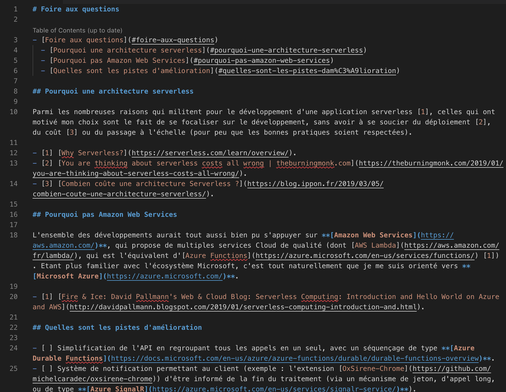
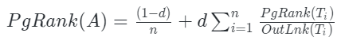
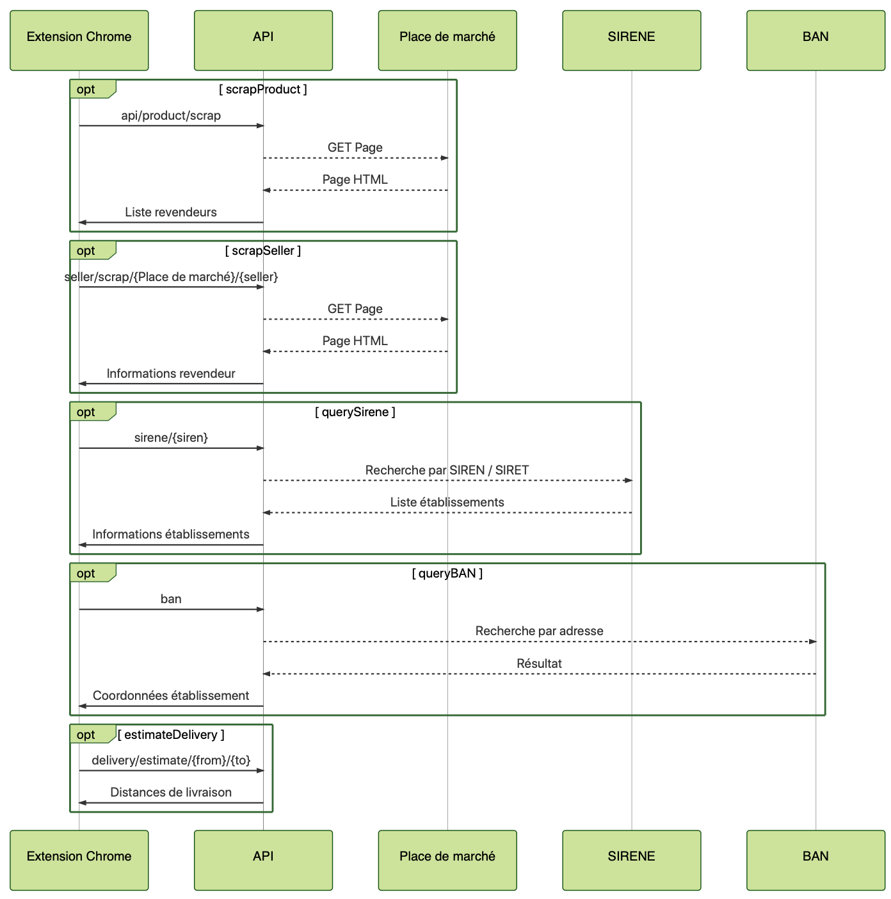
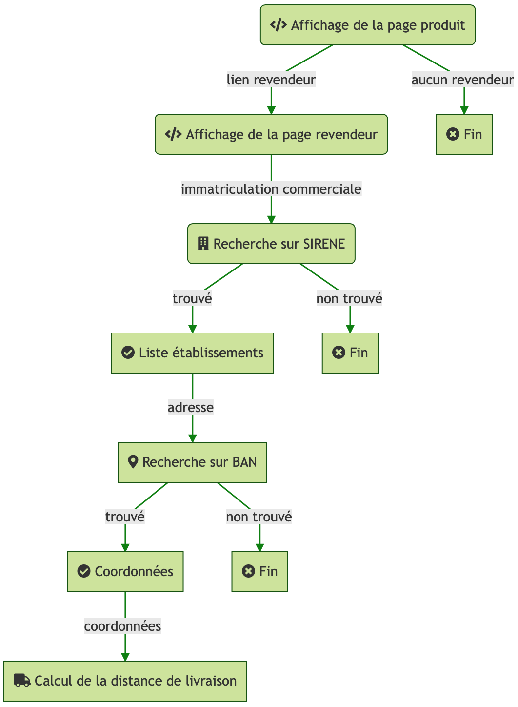

# Documenter avec Markdown

Michel Caradec

---

## Agenda

- Présentation
- Syntaxe
- Conventions
- Outils
- Aller plus loin

note:
- Présentation : genèse, principes
- Syntaxe : la syntaxe en détail
- Conventions : quelques conventions dans l'utilisation du Markdown
- Outils : éditeur + extensions
- Aller plus loin : balises HTML, présentation avec Revealjs, mermaid

---

## Présentation

--

### Genèse

- Langage de balisage (Markup)
- Développé par **John Gruber** et **Aaron Swartz**
- Première Release le 19 mars **2004**

note:
Markup : utilisation de balises pour enrichir le texte. Exemple : HTML, LaTeX

--

### Principes

- Création et consultation **simple**
- **Lisible** en l'état
- Convertible **automatiquement**

> Easy-to-read, easy-to-write.

--

### Avantages

- **Simple** et léger
  - Pas d'outils imposés
- Gain de **temps** sur la mise en forme
- Intégration avec les outils de **développement**
  - Source Control
  - Comparaison / Fusion

note:
[Oublions Powerpoint avec Reveal.js – Framablog](https://framablog.org/2013/11/06/revealjs-alternative-libre-powerpoint/).

--

### Adoption

- [GitHub](https://guides.github.com/features/mastering-markdown/)
- [Stack overflow](https://stackoverflow.com/editing-help)
- TFS / [Azure Devops](https://docs.microsoft.com/en-us/azure/devops/project/wiki/markdown-guidance?view=azure-devops)
- Notebooks
  - [Jupyter](https://jupyter.org/)
  - [RMarkdown](https://rmarkdown.rstudio.com/)

--

### Exemple



note:
Source : <https://github.com/michelcaradec/oxsirene-server/wiki/FAQ>

---

## Syntaxe

note:
- [Basic Syntax | Markdown Guide](https://www.markdownguide.org/basic-syntax)
- [Daring Fireball: Markdown Syntax Documentation](https://daringfireball.net/projects/markdown/syntax)
- [Un guide pour bien commencer avec markdown](https://blog.wax-o.com/2014/04/tutoriel-un-guide-pour-bien-commencer-avec-markdown/)
- [Markdown syntax for files, widgets, and wikis in Azure DevOps](https://docs.microsoft.com/en-us/azure/devops/project/wiki/markdown-guidance?view=azure-devops)

--

### Syntaxe - Texte

Syntaxe :

```raw
Ceci est une ligne.
```

Rendu :

Ceci est une ligne.

--

### Syntaxe - Paragraphe

Syntaxe :

```raw
Ligne avec deux retours charriots.<crlf>
<crlf>
Nouveau paragraphe.
```

Rendu :

Ligne avec deux retours charriots.

Nouveau paragraphe.

--

### Syntaxe - Nouvelle ligne

Syntaxe :

```raw
Ligne se terminant par deux espaces<space><space><crlf>
pour un retour à la ligne.
```

Rendu :

Ligne se terminant par deux espaces  
pour un retour à la ligne.

--

### Syntaxe - Italique

Syntaxe :

```raw
Texte en *italique*.
```

Rendu :

Texte en *italique*.

--

### Syntaxe - Gras

Syntaxe :

```raw
Texte en **gras**.
```

Rendu :

Texte en **gras**.

--

### Syntaxe - Gras et italique

Syntaxe :

```raw
Texte en ***gras et italique***.
```

Rendu :

Texte en ***gras et italique***.

--

### Syntaxe - Barré

Syntaxe :

```raw
Texte ~~barré~~.
```

Rendu :

Texte ~~barré~~.

--

### Syntaxe - URL

Syntaxe :

```raw
Lien [site](https://www.markdownguide.org/basic-syntax).
```

Rendu :

Lien [site](https://www.markdownguide.org/basic-syntax).

note:
Il est aussi possible de créer un lien vers le contenu du document, avec la syntaxe `[](#${HEADER-ENCODED})`.
L'encodage de l'en-tête encodé peut-être trouvé à partir de la génération de la table des matières (extension [Markdown All in One](https://marketplace.visualstudio.com/items?itemName=yzhang.markdown-all-in-one)).

--

### Syntaxe - En-tête : Syntaxe

```raw
# En-tête 1

## En-tête 2

### En-tête 3

#### En-tête 4

##### En-tête 5

###### En-tête 6
```

--

### Syntaxe - En-tête : Rendu


<h1>En-tête 1</h1>

<h2>En-tête 2</h2>

<h3>En-tête 3</h3>

<h4>En-tête 4</h4>

<h5>En-tête 5</h5>

<h6>En-tête 6</h6>

--

### Syntaxe - Equation

Syntaxe :

```raw
$PgRank(A)=\frac{(1-d)}{n}
+d\sum_{i=1}^{n}{\frac{PgRank(T_i)}{OutLnk(T_i)}}$
```

Rendu :



--

### Syntaxe - Ligne horizontale

Syntaxe :

```raw
Avant la ligne horizontale

***

Après la ligne horizontale
```

Rendu :

Avant la ligne horizontale

***

Après la ligne horizontale

--

### Syntaxe - Mention : Syntaxe

```raw
> Les hommes naissent et demeurent libres
> et égaux en droits.
>
> Les distinctions sociales ne peuvent être fondées
> que sur l'utilité commune.
```

note:
Source : [Déclaration des Droits de l'Homme et du Citoyen de 1789](https://www.conseil-constitutionnel.fr/le-bloc-de-constitutionnalite/declaration-des-droits-de-l-homme-et-du-citoyen-de-1789).

--

### Syntaxe - Mention : Rendu

> Les hommes naissent et demeurent libres
> et égaux en droits.
>
> Les distinctions sociales ne peuvent être fondées
> que sur l'utilité commune.

--

### Syntaxe - Code : Ligne

Syntaxe :

```raw
Exemple de `code sur une ligne`.
```

Rendu :

Exemple de `code sur une ligne`.

--

### Syntaxe - Code : Bloc

Syntaxe :

<pre>
<code class="language-raw">
```javascript
const sumSquare =
    [1, 2, 3, 4]
    .map(x => x ** 2)
    .reduce((acc, x) => acc + x, 0);
```
</code>
</pre>

Rendu :

```javascript
const sumSquare =
    [1, 2, 3, 4]
    .map(x => x ** 2)
    .reduce((acc, x) => acc + x, 0);
```

--

### Syntaxe - Liste non-triée : Syntaxe

```raw
- Item 1
  - Item 1.1
  - Item 1.2
- Item 2
- Item 3
- Item 4
```

--

### Syntaxe - Liste non-triée : Rendu

- Item 1
  - Item 1.1
  - Item 1.2
- Item 2
- Item 3
- item 4

--

### Syntaxe - Liste triée

Syntaxe :

```raw
1. Item 1
2. Item 2
3. Item 3
```

Rendu :

1. Item 1
2. Item 2
3. Item 3

--

### Syntaxe - Table

Syntaxe :

```raw
| En-tête 1 | En-tête 2 |
|---|---|
| Cellule 1 | Cellule 2 |
| Cellule 3 | Cellule 4 |
```

Rendu :

| En-tête 1 | En-tête 2 |
|---|---|
| Cellule 1 | Cellule 2 |
| Cellule 3 | Cellule 4 |

--

### Syntaxe - Table avec justification

Syntaxe :

```raw
| Défaut | Centré | Gauche | Droite |
|---|:-:|:--|--:|
| 1 | 2 | 3 | 4 |
| 56 | 78 | 90 | 12 |
```

Rendu :

| Défaut | Centré | Gauche | Droite |
|---|:-:|:--|--:|
| 1 | 2 | 3 | 4 |
| 56 | 78 | 90 | 12 |

--

### Syntaxe - Image

Syntaxe :

```raw

```

Rendu :


note:
Il est aussi possible d'utiliser une URL : <https://fr.wikipedia.org/wiki/Markdown#/media/File:Markdown-mark.svg>.

--

### Syntaxe - URL / Email

Syntaxe :

```raw
<https://www.markdownguide.org/>

<contact@markdown.org>

```

Rendu :

<https://www.markdownguide.org/>

<contact@markdown.org>

---

## Conventions

- Extension de fichier en **.md**
- Nom de fichier de documentation **README.md**
- Références : numéro de référence entre crochets
    Exemple :

    ```raw
    Dans l'étude XXX [1], ...

    - [1] Etude XXX consultable sur <https://etude.org/>.
    ```

note:
Référence : <https://www.markdownguide.org/basic-syntax#reference-style-links>.

---

## Outils

- Editeurs en ligne :
  - [Dillinger](https://dillinger.io)
  - [StackEdit](https://stackedit.io/)
- Editeur cross-plateforme :
  - [Visual Studio Code](https://code.visualstudio.com)

note:
StackEdit supporte la syntaxe mermaid.

--

### Extensions VS Code - 1

| Extension | Usage |
|---|---|
| [Markdown All in One](https://marketplace.visualstudio.com/items?itemName=yzhang.markdown-all-in-one) | Fonctions d'**édition avancées** :<br>raccourcis clavier, table des matières, pré-visualisation, etc. |
| [markdownlint](https://marketplace.visualstudio.com/items?itemName=DavidAnson.vscode-markdownlint) | **Vérification** du Markdown. |

--

### Extensions VS Code - 2

| Extension | Usage |
|---|---|
| [Markdown Preview Github Styling](https://marketplace.visualstudio.com/items?itemName=bierner.markdown-preview-github-styles) | Pré-visualisation façon **Github**. |
| [Markdown PDF](https://marketplace.visualstudio.com/items?itemName=yzane.markdown-pdf) | Conversion **PDF**. |
| [Spell Right](https://marketplace.visualstudio.com/items?itemName=ban.spellright) | Vérification **syntaxique**. |

--

### Extensions Visual Studio

| Extension | Usage |
|---|---|
| [Markdown Editor](https://marketplace.visualstudio.com/items?itemName=MadsKristensen.MarkdownEditor) | Editeur Markdown intégré à Visual Studio. |

--

### Utilitaires

| Outils | Usage |
|---|---|
| [Copy selection as markdown](https://addons.mozilla.org/en-US/firefox/addon/copy-selection-as-markdown/) | Addon **Firefox** de copie au format Markdown. |
| [Markdown Tables](http://www.tablesgenerator.com/markdown_tables)<br>[Table Editor](https://truben.no/table/) | Création de **tables** au format Markdown. |
| [ASCIIFlow Infinity](http://asciiflow.com/)<br>[Textik - ASCII diagrams editor](https://textik.com/) | Création de **schémas**. |

---

## Aller plus loin

--

### Balises HTML - 1

Zones extensibles : `<details>` et `<summary>`.

Syntaxe :

```raw
<details>
<summary>Titre de la zone à étendre</summary>
Détail de la zone.
</details>
```

Rendu :

<details>
<summary>Titre de la zone à étendre</summary>
Détail de la zone.
</details>

note:
Même s'il est possible d'inclure des balises HTML dans le Markdown, cette pratique est à éviter, car elle nuit à la lisibilité du texte. Cette pratique s'avère néanmoins utile pour des présentations.

--

### Balises HTML - 2

| Balise | Usage | Syntaxe / Rendu |
|---|---|---|
| `<br>` | Retour à la ligne (tableaux). | `Ligne 1<br>Ligne 2`<br>`Ligne 1`<br>`Ligne 2` |
| `<kbd>` | Touche clavier. | `Appuyer sur <kbd>Entrée</kbd>`<br>Appuyer sur <kbd>Entrée</kbd> |

note:
Pour un retour à la ligne, voir aussi [Syntaxe - Nouvelle ligne](#syntaxe---nouvelle-ligne).

--

### Balises HTML - 3

| Balise | Usage | Syntaxe / Rendu |
|---|---|---|
| `<mark>` | Surligner. | <small>`Texte à <mark>surligner</mark>`</small><br>Texte à <mark>surligner</mark> |
| `<span>` | Style avancé. | <small>`Texte en <span style="color:red">rouge</span>`</small><br>Texte en <span style="color:red">rouge</span> |

--

### Revealjs

- Extension Visual Studio Code
  - [vscode-reveal](https://marketplace.visualstudio.com/items?itemName=evilz.vscode-reveal)
- Présentation à partir d'un document Markdown

note:
Cette présentation a été écrite en Markdown, et présentée avec Revealjs !
/!\ Le document doit avoir des fins de lignes en LF (et pas CRLF).

--

### Mermaid

- Génération de diagrammes et flux
- [Mermaid Live Editor](https://mermaidjs.github.io/mermaid-live-editor/)

note:
/!\ N'est pas un standard de Markdown. Vérifier le support avant de l'utiliser.
Exemples avec <assets/api-workflow.mmd> et <assets/detailed-workflow.mmd>.
Extension Visual Studio Code [Markdown Preview Mermaid Support](https://marketplace.visualstudio.com/items?itemName=bierner.markdown-mermaid) pour la preview.

--

### Mermaid - Exemple 1



note:
Source : <https://github.com/michelcaradec/oxsirene-server/wiki/assets/api-worklow.png>

--

### Mermaid - Exemple 2



note:
Source : <https://github.com/michelcaradec/oxsirene-chrome/wiki/assets/detailed-workflow.png>

---

**Merci de votre attention.**

---

## Questions & Réponses

---

## One more thing

--

### Markdeep

Documentation sous stéroïdes : [Markdeep](http://casual-effects.com/markdeep/)

note:
Markdeep is a technology for writing plain text documents that will look good in any web browser, whether local or remote. It supports diagrams, calendars, equations, and other features as extensions of Markdown syntax.
